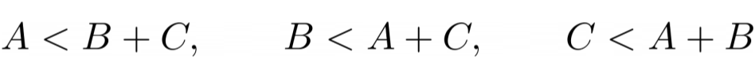
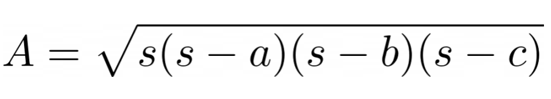
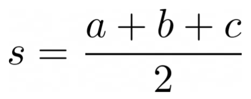

# Is this a Triangle?

The following assignment is about geometry -- rectangles and triangles are objects that can be modeled with Java! You are going to practice on `if` and `else`-statements and be introduced to the *triangle inequality*.


### 💀 Deadline
This work should be completed before the exercise, on **Weekday 10th Month** depending on your group.

### 👨🏽‍🏫 Instructions
For instructions on how to do and submit the assignment, please see the
[assignments section of the course instructions](https://gits-15.sys.kth.se/inda-21/course-instructions#assignments).

### 📝 Preparation

You must read and answer the questions in the OLI material for Module 2.

- Read [Module y: title of module]([link to OLI](https://www.youtube.com/watch?v=dQw4w9WgXcQ))
- If you have not done so, goto https://kth.oli.cmu.edu/, signup and register for the course key `dd1337-ht22`

### ✅ Learning Goals
This weeks learning goals include:

1. Branching (`if` and `else` statements)
2. Access object fields and methods with dot-notation
3. Using the Java Math Library

### 🚨 Troubleshooting Guide
If you have any questions or problems, follow this procedure: <br/>

1. Look at this week's [posted issues](https://gits-15.sys.kth.se/inda-22/help/issues). Are other students asking about your problem?
2. If not, post a question yourself by creating a [New Issue](https://gits-15.sys.kth.se/inda-22/help/issues/new). Add a descriptive title, beginning with "Task *x*: *summary of problem here*"
3. Ask a TA in person during the [weekly lab](https://queue.csc.kth.se/Queue/INDA). Check your schedule to see when next lab is.

We encourage you to discuss with your course friends, but **do not share answers**!

### 🏛 Assignment

#### Exercise 3.0 -- A Triangle Object
Create a new class called `Triangle.java` in the [src](src/) directory. The triangle class should have three fields of type `int` -- the sides `a`, `b` and `c`. Add a constructor that takes one parameter per side of the triangle, setting each sides' value to the corresponding parameter. The main method of the example below should compile if implemented correctly.

<details>
  <summary> 🛠 Main method example </summary>

```Java
public static void main(String[] args){
  // create a new Triangle object with the sides 3, 1 and 1
  Triangle triangle = new Triangle(3, 1, 1);
}
```
</details>

#### Exercise 3.1 -- The Triangle Inequality
*The Triangle Inequality* is a popular theorem in mathematics. In simplified terms, it lets you know if three sides, *a*, *b*, and, *c*, can make a triangle. For example, if I give you *a = 3*, *b = 1* and *c = 1*, you can **not** make a triangle. An example of valid input is *a = 1*, *b = 1* and *c = 1*.

Create a method in the `Triangle` class with the following header `private boolean validTriangle(int a, int b, int c)`, that returns `true` if the parameters can construct the sides of a traingle, and `false` in all other cases.

A straightforward approach is checking if the three following relations are true. If they are, then the sides *A*, *B* and *C*, can make a triangle:



You should put the check at the top of your constructor and try the previous example again:

```Java
public Triangle(int a, int b, int c) {
  if(validTriangle(a, b, c)) {
    // Okay to create the Triangle object!
  } else {
    // End the program with an error message
    throw new IllegalArgumentException("This is not a valid triangle!");
  }
}
```

> **Assistant's Note:** There are various ways to achieve this. Under the [Wikipedia page for the Triangle Inequality](https://en.wikipedia.org/wiki/Triangle_inequality#Mathematical_expression_of_the_constraint_on_the_sides_of_a_triangle) there are some useful expressions you can use. Although it is not necessary, you may also use the [Java Math Library](https://docs.oracle.com/javase/tutorial/java/data/beyondmath.html).

#### Exercise 3.2 -- The three types of Triangles

From the [Wikipedia page on Triangles](https://en.wikipedia.org/wiki/Triangle) you can read about the three types of triangles. Make a method in the `Triangle` class called `String getTriangleType()` that returns a `String` of what type the triangle is (*"Equilateral"*, *"Isosceles"* or *"Scalene"*).

Equilateral Triangle             |  Isosceles Triangle | Scalene Triangle
:-------------------------:|:-------------------------:|:-------------------------:
  |   | 

> **From Wikipedia:** Hatch marks, also called tick marks, are used in diagrams of triangles and other geometric figures to identify sides of equal lengths. A side can be marked with a pattern of "ticks", short line segments in the form of tally marks; two sides have equal lengths if they are both marked with the same pattern.

#### Exercise 3.3 -- `Triangle.getArea()`
In this exercise, you have to calculate the area of a triangle. Mathematican's have come up with *many* formulas to achive this, but since our triangle object have the side lenghts as fields, we recommend using [Heron's Formula](https://en.wikipedia.org/wiki/Heron%27s_formula). The formula states that the area of a triangle whose sides have lengths *a*, *b* and *c* is



where *s* is the *semi-perimeter* of the triangle:



The method has to be called `getArea()` and return a `double`. Test your implementation before you push your solution to GitHub!

<details>
<summary> 📚 How-to: square root (Java Math Library) </summary>
<! -- requires a blank space -->

In order to find the square root of an experssion, you have to use the [Java Math library](https://docs.oracle.com/javase/8/docs/api/java/lang/Math.html). To take the square root of any number, you make the following call:

```Java
Math.sqrt(argument); // "argument" can be either a number, or an expression that evaluates to a number
```

</details>

> **Assistant's Note:** To use Heron's Formula you need the *semi-perimeter* *s*. We suggest you add a so-called *helper method*, called `getPerimiter()`, to your Triangle class.

##### 💭 Food for thought
An example of why one would use getters and setters to ensure encapsulation:

1. Create a triangle with the sides *a = 1*, *b = 1*, and, *c = 1*.
2. Change *a* from 1 to 3.
3. Do you still have a valid triangle?
4. How would you fix this?

You don't have to provide any answers, but it will be helpful to think about.

#### Exercise 3.4 -- Reverse Engineering
Now that you have created a `Triangle` class, let's also create a `Rectangle` class along with some useful methods.
For this exercise, you will not be given detailed instructions. Instead, you will need to read trough the code in the [`src/RectangleExample`](src/RectangleExample) file. This code will attempt to create a `Rectangle` object and call three different methods on it. At the moment, it will not compile and run, since there is no `Rectangle.java` file, so start by creating this file in your [src](src) folder.

You will now need to create the fields, getters, setters and required methods in your `Rectangle` class that will allow `RectangleExample` to run and produce the correct results. Your code does not need to cover every edge case, but make sure to run the `RectangleExample` and check so that your methods return the expected values. If you get stuck, don't hesitate to get help through any of the channels listed in the Troubleshooting section.


### 🐞 Bugs and errors?
If you find any inconsistencies or errors in this exercise, please open a [New Issue](https://gits-15.sys.kth.se/inda-22/help/issues/new) with the title "Task *x* Error: *summary of error here*". Found bugs will be rewarded by mentions in the acknowledgment section.

### 🙏 Acknowledgment
This task was designed by                <br>
[Linus Östlund](mailto:linusost@kth.se)  <br>
[Sofia Bobadilla](mailto:sofbob@kth.se)  <br>
[Gabriel Skoglund](mailto:gabsko@kth.se) <br>
[Arvid Siberov](mailto:asiberov@kth.se)  <br>
